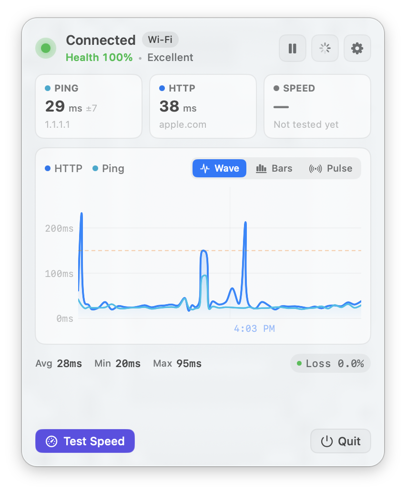

# Connection Watch

A macOS menu bar app that tells you whether your internet is actually working — and when it isn't, which part broke.



## Why it's useful

"Connected" doesn't mean working. Connection Watch runs two independent probes — an ICMP ping burst and an HTTP request — and scores them separately, so when they disagree you get a diagnosis instead of a green dot:

| Symptom | Likely cause |
| --- | --- |
| Ping fine, HTTP slow | DNS or the far end |
| Both spiking together | Your local link |
| High jitter, no loss | Congested Wi-Fi |

It's quiet by design — background monitoring is one ping burst and one HTTP `HEAD` request every 10 seconds. The download speed test only runs when you press the button, because a monitor that saturates your connection to measure it is mostly measuring itself.

It also won't cry wolf. Plenty of corporate, hotel, and VPN networks silently drop ICMP. Connection Watch notices and scores on HTTP alone instead of parking a red light on a perfectly good connection.

## Features

- Live latency or health score right in the menu bar
- 0–100 health score from latency, jitter, packet loss, and HTTP response time
- Plain-language diagnostics — *"High jitter (±35ms)"*, *"ICMP filtered (using HTTP only)"*
- Latency chart with avg / min / max and packet loss
- On-demand download speed test
- Notifications on state changes, rate limited so they don't nag
- Configurable ping target, probe interval, and thresholds
- Launch at login · Universal binary (Apple Silicon + Intel)

## Install

Requires macOS 14 or later.

### Option 1 — Download a build

1. Download the latest `.zip` from [**Releases**](../../releases).
2. Unzip it and drag **Connection Watch.app** into **Applications**.
3. **First launch only:** right-click the app → **Open** → **Open**.

> [!NOTE]
> Releases are ad-hoc signed but not notarized by Apple, so macOS blocks them on first launch. Step 3 gets you past it. If you instead see a *"damaged and can't be opened"* error, clear the quarantine flag:
> ```sh
> xattr -dr com.apple.quarantine "/Applications/Connection Watch.app"
> ```

### Option 2 — Build it yourself

```sh
git clone https://github.com/LyalinDotCom/connection-watch.git
cd connection-watch
xcodebuild -scheme ConnectionWatch -configuration Release -derivedDataPath build
open build/Build/Products/Release
```

No dependencies and no package manager — or just open `ConnectionWatch.xcodeproj` and hit Run.

## Heads up

This is a side hobby project. I build it for myself, on my own schedule, with no roadmap and no support.

**I'm not accepting pull requests or feature requests.** If you want it to work differently, fork it — that's what the license is for.

## License

[Apache 2.0](LICENSE). Copy it, fork it, ship it.
